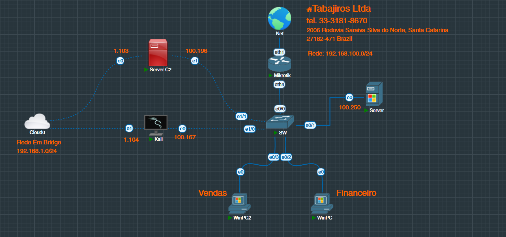
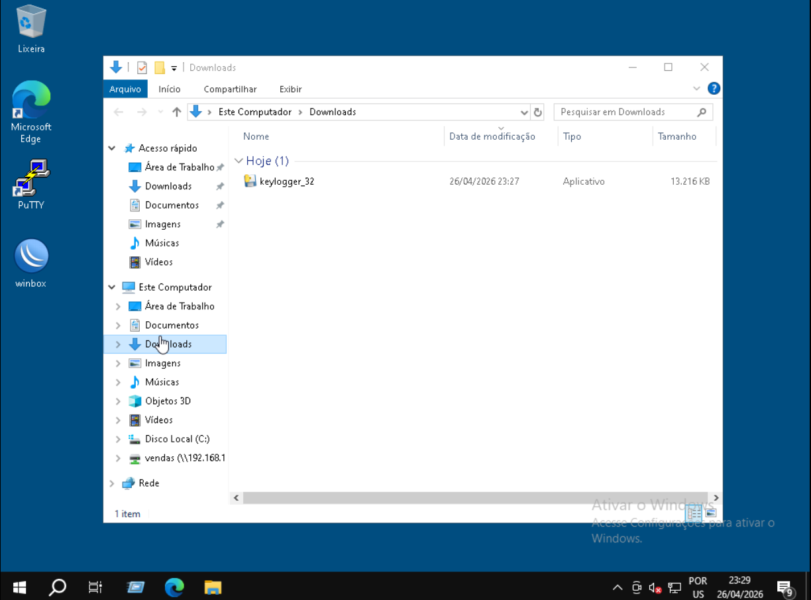
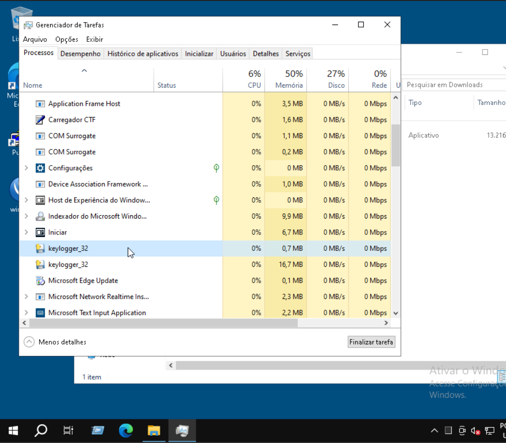
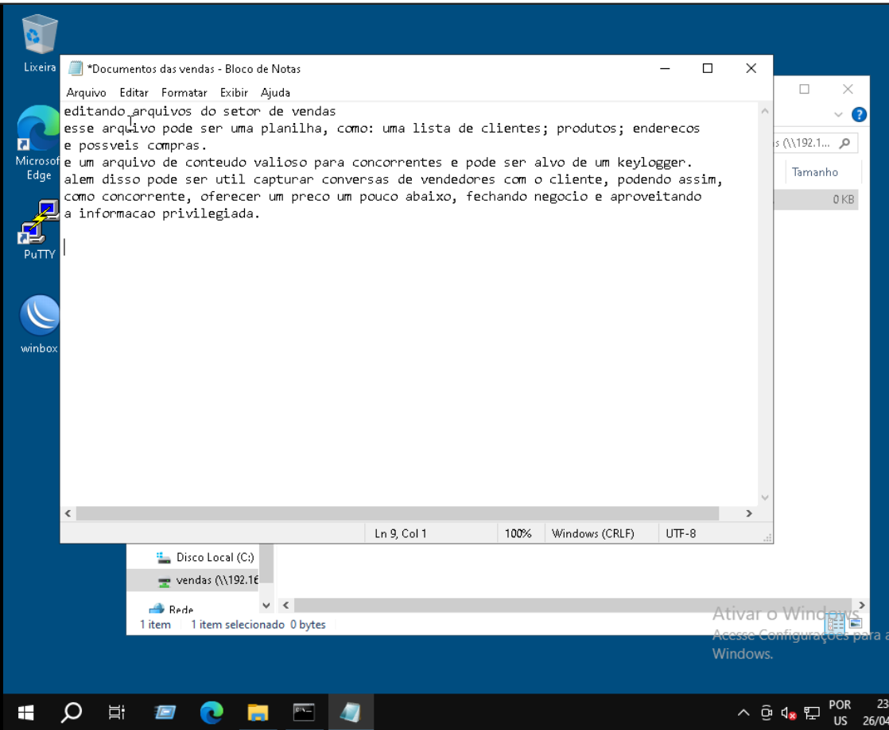
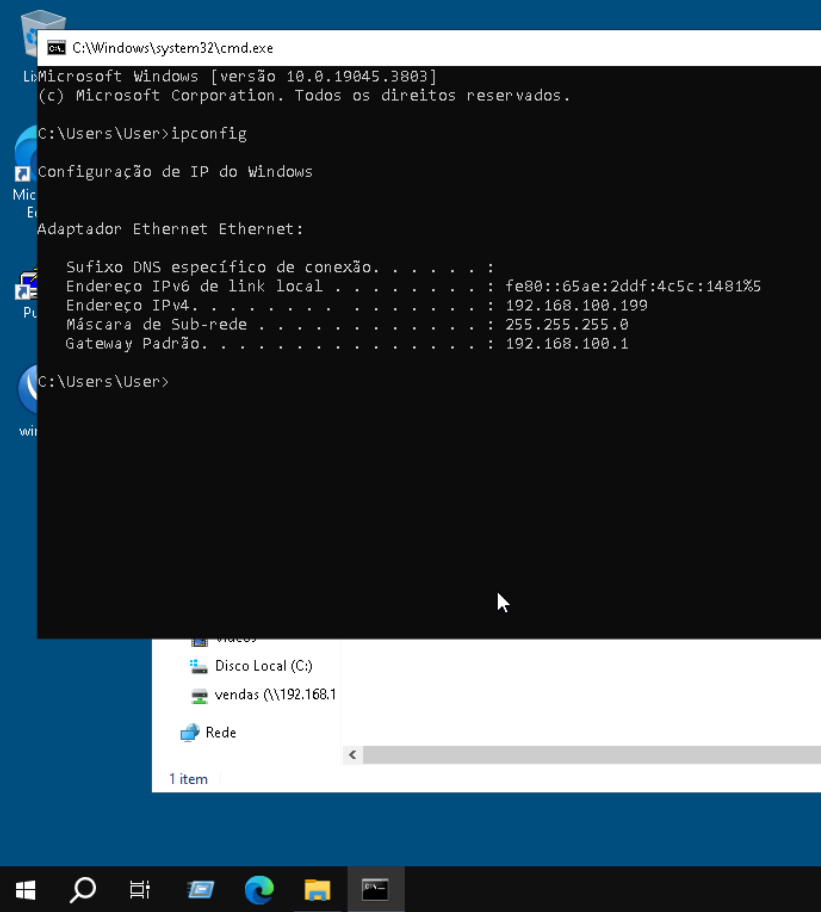
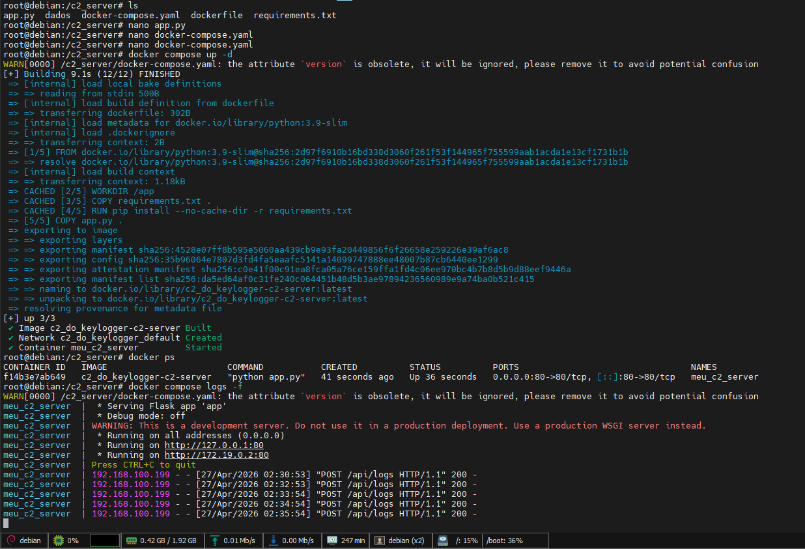
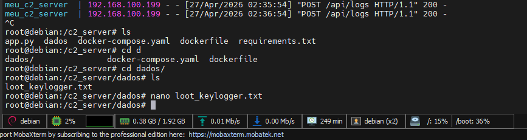
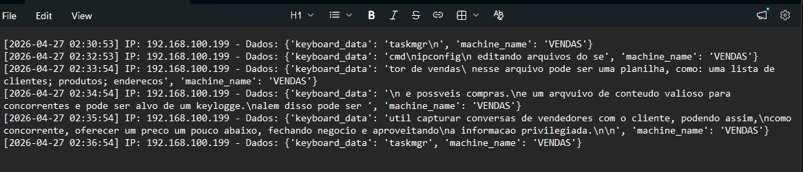

# Desafio DIO - Simulação de Ransomware e Keylogger

Projeto final do Bootcamp de Cibersegurança Riachuelo (DIO).
Nesta etapa, o objetivo é desenvolver e testar, em ambiente 100% controlado e isolado, ferramentas de ransomware e keylogger para fins estritamente educativos.

---

## Sumário
1. [Ransomware Educacional Simulado](#1-ransomware-educacional-simulado)
    * 1.1 [Simulação e Funcionamento](#11-simulação-e-funcionamento)
    * 1.2 [Táticas de Defesa e Prevenção](#12-táticas-de-defesa-e-prevenção)
    * 1.3 [Conclusão do Módulo Ransomware](#13-conclusão)
2. [Documentação Técnica: Keylogger e Exfiltração](#2-documentação-técnica-simulação-de-keylogger-e-exfiltração-via-c2)
    * 2.1 [Escopo do Projeto](#21-escopo-do-projeto)
    * 2.2 [Topologia do Laboratório](#22-topologia-do-laboratório)
    * 2.3 [Arquitetura do Servidor C2](#23-arquitetura-do-servidor-c2-command--control)
    * 2.4 [Desenvolvimento e Vetores de Infecção](#24-desenvolvimento-e-vetores-de-infecção)
    * 2.5 [Análise de Execução e Detecção](#25-análise-de-execução-e-detecção)
    * 2.6 [Simulando Entradas do Usuário](#26-simulando-entradas-do-usuário)
    * 2.7 [Resultados e Logs de Captura](#27-resultados-e-logs-de-captura)
    * 2.8 [Sugestões de Melhora](#28-sugestões-de-melhoras)
    * 2.9 [Arquivos Disponíveis](#29-arquivos)
    * 2.10 [Conclusão e Mitigação](#210-conclusão-e-mitigação)

---

# 1. Ransomware Educacional Simulado

Este projeto prático foi desenvolvido em um ambiente 100% controlado e com fins educacionais. O ransomware foi criado somente para ser utilizado em testes simulados e não tem a intenção de ser utilizado para crimes.

O desafio propõe a criação de um ransomware, a execução de testes de criptografia e descriptografia, e a geração de uma mensagem de resgate.

## 1.1 Simulação e Funcionamento
Tanto o ransomware quanto o script de descriptografia (decript) foram escritos em Python e, posteriormente, transformados em executáveis utilizando a ferramenta `Pyinstaller`.

1.  **Ransomware:** Script de criptografia e geração de nota de resgate.
2.  **Decryptor:** Script de recuperação de dados.

### 1.1.1 Ambiente de Teste
Os testes de funcionamento foram realizados utilizando arquivos de texto. 
Na imagem abaixo, podemos ver o executável do ransomware e um arquivo de testes aberto:

### 1.1.2 Processo de Criptografia
O malware funciona criando uma chave de criptografia no mesmo diretório em que é executado. Em seguida, ele percorre todo o diretório em busca de arquivos e criptografa todos os documentos encontrados (exceto a própria chave, o executável do ransomware e o decript).

Na imagem a seguir, podemos ver a chave gerada e o arquivo de texto que agora se encontra criptografado:

Como parte da simulação, o script também gera e exibe um arquivo de resgate no diretório comprometido:

### 1.1.3 Processo de Descriptografia
Ao executar o programa `Decript`, ele faz o caminho inverso. O script percorre o diretório em busca dos arquivos afetados e realiza a descriptografia, restaurando o acesso aos dados originais.

## 1.2 Táticas de Defesa e Prevenção

Para mitigar e nos proteger dessas ameaças no mundo real, diversas medidas de segurança podem ser adotadas em conjunto:

* **Antivírus:** Antivírus atuais têm proteção robusta contra ransomware, ajudando a bloquear a execução de binários maliciosos.
* **Backups e Snapshots:** Manter snapshots e rotinas de backup em dia é uma prática básica e essencial, que funciona perfeitamente caso os dados originais sejam perdidos e não tenham sido exfiltrados.
* **Firewall e Sandboxing:** O uso de firewalls rigorosos impede que o malware se comunique com a rede externa, enquanto o sandboxing permite a execução e análise de arquivos suspeitos em um ambiente seguro e isolado.
* **Conscientização do Usuário:** O treinamento de usuários é a primeira linha de defesa, evitando que e-mails de phishing ou downloads maliciosos iniciem a infecção.
* **Proteção contra Exfiltração:** Para impedir a exfiltração de dados críticos em casos de invasão, é fundamental implementar a criptografia contínua desses dados no ambiente de armazenamento. Sugere-se fortemente a criptografia preventiva de discos e bancos de dados para dificultar a leitura e exfiltração das informações por agentes maliciosos.

## 1.3 Conclusão
Em um ataque de ransomware real, a dinâmica possui algumas complexidades adicionais. A chave de criptografia gerada localmente geralmente seria exfiltrada para um servidor C2 (Command and Control) sob posse do atacante. Além disso, ransomwares reais costumam buscar arquivos de extensões bem específicas e valiosas para o usuário, como `.doc`, `.xls`, `.jpeg`, entre outras. 

Através desta simulação educacional, já podemos ter uma ideia clara e prática de como funciona a mecânica de um ransomware sob o capô e de como podemos nos prevenir contra esse tipo de ataque.

---

# 2. Documentação Técnica: Simulação de Keylogger e Exfiltração via C2

## 2.1 Escopo do Projeto
Este projeto documenta o desenvolvimento e a implementação de um **keylogger** para fins educacionais, simulando um cenário real de ataque e exfiltração de dados em um ambiente controlado.
O Desafio consiste em criar um keylogger e fazer uma simulação da captura dos dados em um arquivo .txt. Resolvi mudar alguns parâmetros para que o ataque se parecesse com um ataque real de um caso do qual eu já trabalhei.

* **Objetivo:** Capturar inputs de teclado e exfiltrar os dados para um servidor remoto via protocolo HTTP.
* **Diferencial:** Implementação de um servidor de Comando e Controle (C2) centralizado em substituição ao envio tradicional por e-mail.

## 2.2 Topologia do Laboratório
O ambiente foi construído utilizando a plataforma **PNETLab**, replicando a infraestrutura da empresa fictícia "Tabajiros".

* **Gateway/Firewall:** MikroTik RouterOS.
* **Networking:** Switch L2 Cisco.
* **Endpoints Alvos:** 2x Windows 10 e 1x Windows Server 2008.
* **Infraestrutura de Ataque:** * **Kali Linux:** Utilizado para desenvolvimento e entrega do payload.
    * **Debian 12 (C2 Server):** Host do servidor de recebimento de dados.

## 2.3 Arquitetura do Servidor C2 (Command & Control)
Ao invés de enviá-las para uma conta de e-mail, o keylogger as envia para um **servidor C2 (command-and-control)**. Para a simulação, este está localizado no próprio laboratório, mas poderia ser uma **EC2** ou qualquer outra **VPS** escondida atrás de um IP da Cloudflare ou uma VPN.
O aplicativo que recebe os dados é um app de código em **Python**, utilizando o **Flask** para hospedá-lo. Ambos sobem no servidor com um container, do qual utilizei **Docker Compose** para montá-lo.

O servidor C2 atua como o *listener* do ataque:
* **Tecnologias:** Desenvolvido em **Python** com o micro-framework **Flask**.
* **Deployment:** Implementado via **Docker Compose**, garantindo isolamento e facilidade de replicação.
* **Exfiltração:** O servidor processa requisições `POST` contendo os logs de teclas capturadas, simulando tráfego HTTP legítimo para evitar detecção básica por firewalls.

## 2.4 Desenvolvimento e Vetores de Infecção
O Keylogger foi enviado para o computador no formato de um executável, montado com a biblioteca **pyinstaller**. Poderíamos utilizar técnicas como **engenharia social**, fundir esse executável a outro arquivo como um .PDF ou .PNG e enviá-lo por e-mail utilizando a técnica de **warp** ou **binder**, ou mesmo executá-lo através de uma invasão com o **meterpreter**.

### Possíveis Vetores de Entrega (Simulados):
* **Engenharia Social:** Phishing via e-mail com técnicas de *File Binding* (fusão do executável com PDFs ou imagens).
* **Exploração de Vulnerabilidades:** Execução remota via **Meterpreter** após comprometimento inicial do host.

## 2.5 Análise de Execução e Detecção
Nesta fase, validamos o comportamento do artefato no endpoint "Vendas".

Depois de executado podemos vê-lo rodando no Task Manager. Keyloggers mais profissionais e com boa ocultabilidade escondem seu nome ou o trocam para o nome de outro programa conhecido. Uma maneira de diagnosticar um Keylogger é verificando as conexões abertas do dispositivo, o que pode ser feito com o comando `netstat -a` ou olhando a tabela *firewall > connections* no MikroTik. Abertura de portas de SMTP ou conexões suspeitas denunciam o keylogger; como este envia informações via POST HTTP, pode ser confundido com um navegador comum.

### Perspectiva de Defesa (Blue Team):
* **Processos:** Monitoramento do *Task Manager* em busca de processos suspeitos ou masquerading (nomes de processos legítimos).
* **Rede:** Identificação de persistência através de conexões ativas com o comando `netstat -a`.
* **Firewall:** Monitoramento da tabela de conexões no MikroTik para identificar comunicações anômalas na porta 80/443 destinadas a IPs externos não catalogados.

## 2.6 Simulando entradas do usuário
Feito um teste digitando aleatoriamente no bloco de notas, simulando a digitação do usuário.

### Verificação de Recebimento (C2):
O servidor C2 registrou com sucesso as requisições provenientes do IP do host "Vendas", armazenando o conteúdo em formato `.txt`.

## 2.7 Resultados e Logs de Captura
Podemos abrir os logs de captura direto no C2 ou baixá-los e abri-los utilizando o Notepad.

Abrindo no servidor com o Nano:

Baixando e abrindo no Windows com o Notepad:

## 2.8 Sugestões de melhoras
Como o laboratório é feito para testes, não houve preocupação em deixar o keylogger totalmente oculto. Sugestões de melhorias que podem ser aplicadas:
* Melhora na ocultabilidade no Task Manager.
* Melhora na formatação do texto recebido para maior clareza.
* Inicialização automática no Windows em um diretório oculto.
* Mudança de nome para o de um processo legítimo do Windows.

## 2.9 Arquivos
Em `/keylogger` encontram-se os seguintes arquivos disponíveis:
* **keylogger source**: código-fonte compactado (ideal para Windows, para evitar que o antivírus exclua o código).
* **keylogger**: código-fonte. 
* **keylogger_32**: arquivo `.exe` compilado para rodar em Windows 32 bits.

## 2.10 Conclusão e Mitigação
Um keylogger captura informações digitadas e as envia para um servidor remoto, o que pode ser extremamente danoso se capturar logins e senhas sensíveis.

A maioria dos malwares começa explorando engenharia social e falhas humanas. Para uma boa segurança, são necessários treinamentos constantes em todos os setores da empresa para mitigar vulnerabilidades.

**Recomendações de Segurança:**
1.  **Hardening de Endpoint:** Restrição de execução de binários não assinados.
2.  **Segurança de Rede:** Implementação de inspeção SSL/TLS para identificar tráfego C2 mascarado como HTTP.
3.  **Treinamento Anti-Phishing:** Fortalecimento da cultura de segurança contra engenharia social.